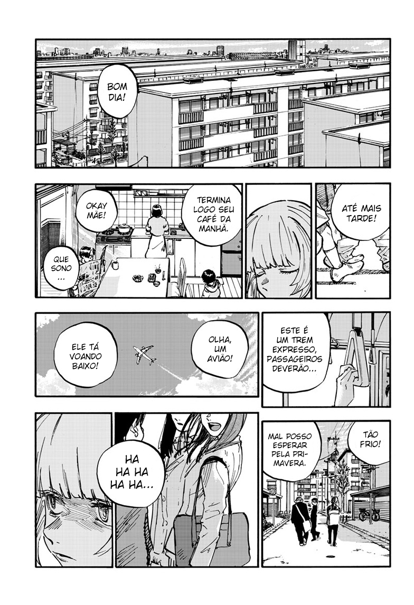
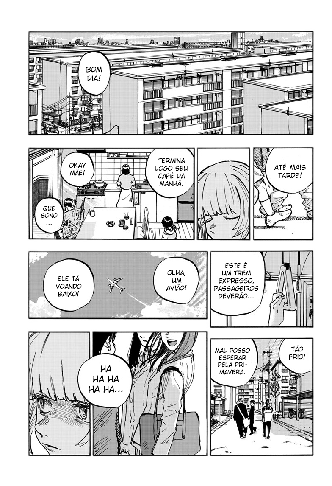

<div align="center">

# [ML] Manga (Dark Mode)


</div>
<div align="left">

## 📃 | Description
Um simples projeto feito em Python (training) e TypeScript (proxy/tests) para remover o background de mangas. Fiz isso, pois leio mangas majoritariamente a noite.

|Input|Output|
|--|--|
|||

Esse projeto usa U-Net, e foi implementado usando Tensorflow.

U-Net article:
```
Ronneberger, Olaf, Philipp Fischer, and Thomas Brox.
"U-net: Convolutional networks for biomedical image segmentation."
In International Conference on Medical Image Computing and Computer-Assisted Intervention, pp. 234-241. Springer, Cham, 2015.
```

## ⚙️ | Requirements
| Program | Vesion |
|--|--|
| Nodejs | v21.5.0 |
| Python | v3.10.12 |

## 💹 | Production

```
npm install

# For ARM64
npm rebuild @tensorflow/tfjs-node --build-from-source

# Start
npm run production
```

## 🐛 | Develop


##### Requirements

```sh
pip install -r requirements.txt
```

##### Pillow

```sh
apt install libjpeg-dev zlib1g-dev

python3 -m pip install --upgrade pip setuptools wheel
sudo pip3 install pillow --no-binary :all:
```

##### Start Virtual Environment on Windows

WSL2: https://www.tensorflow.org/install/pip?hl=pt-br#windows-wsl2_1

###### Linux

```sh
virtualenv ./

source bin/activate
```

### Training

```sh
# Look for the best result.
python training/start.py --best

# Run a ready-made script.
python training/start.py --unet
```

##### Saving current Libs

```sh
pip freeze > .\requirements.txt
```
