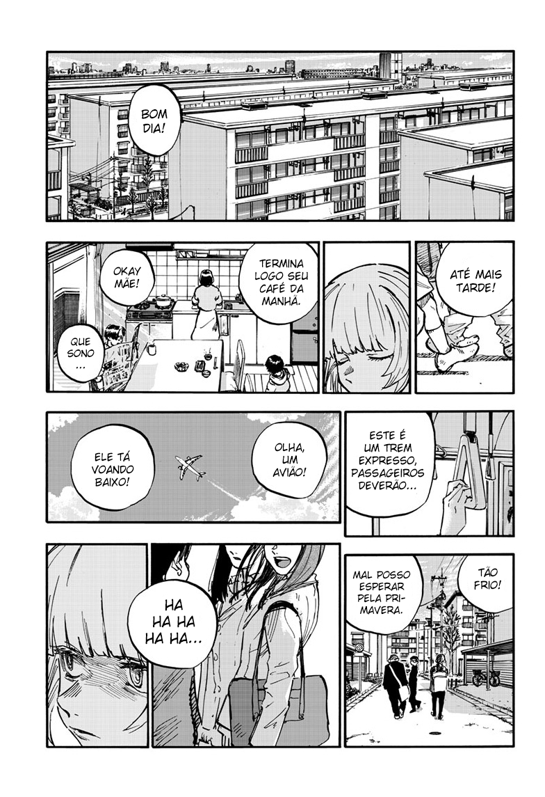
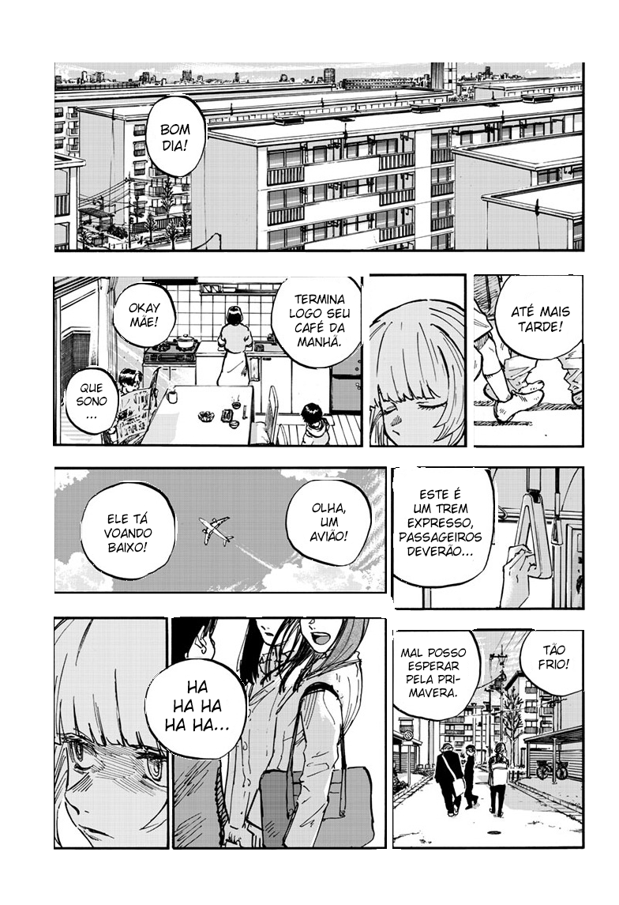
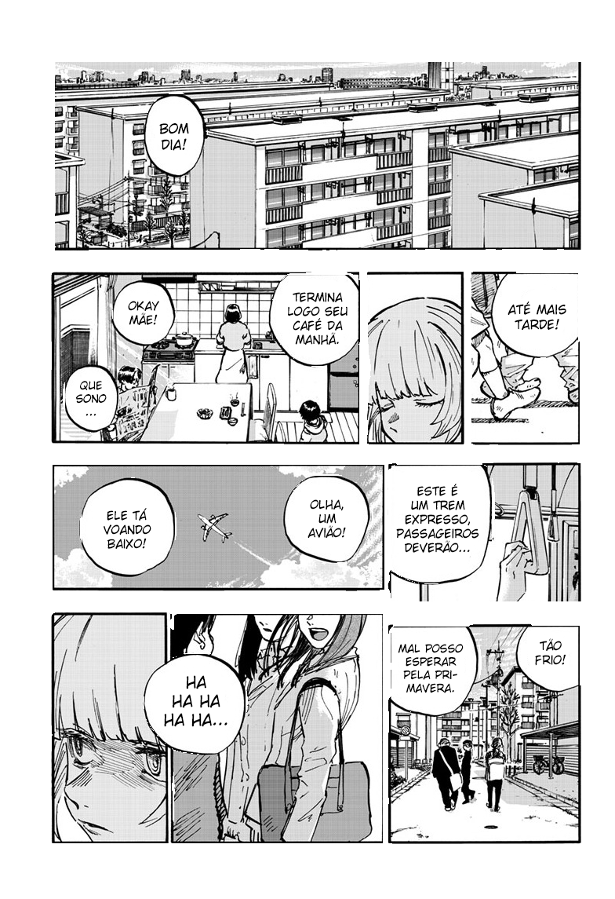
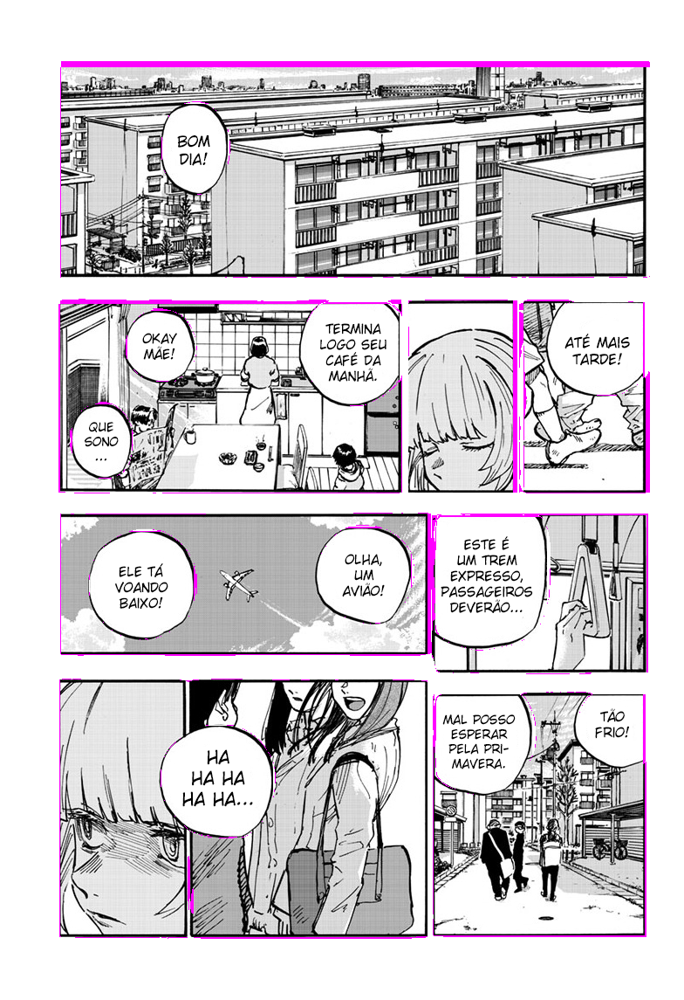
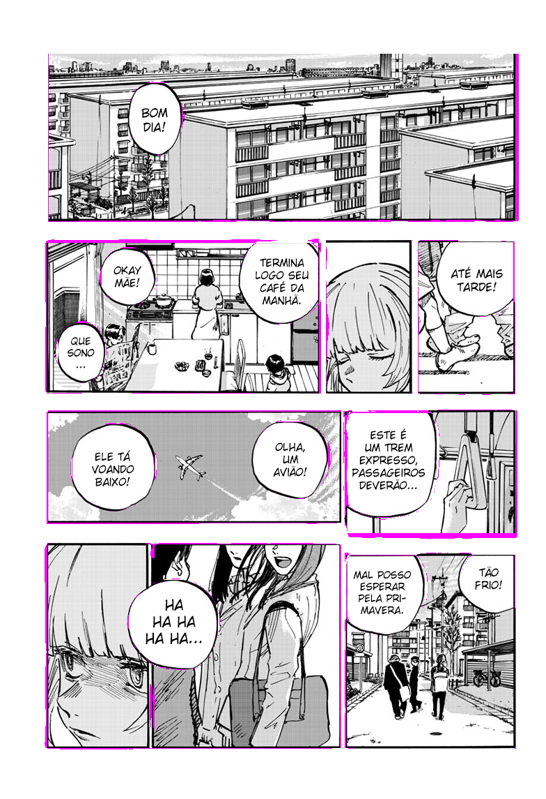
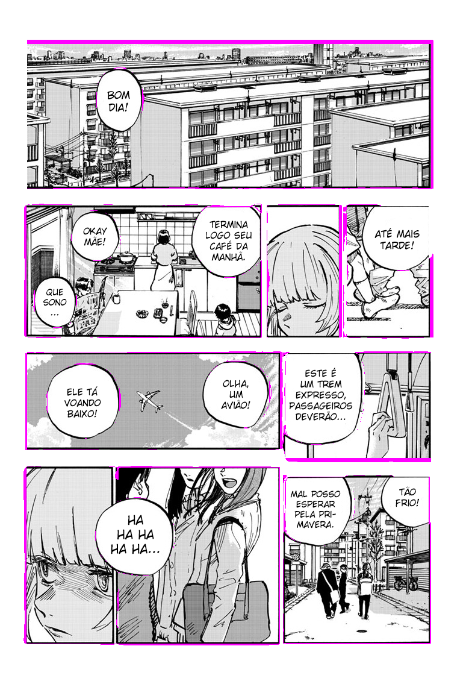
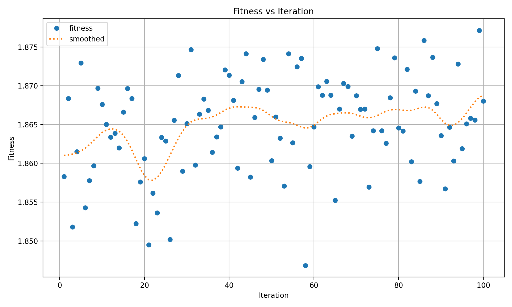
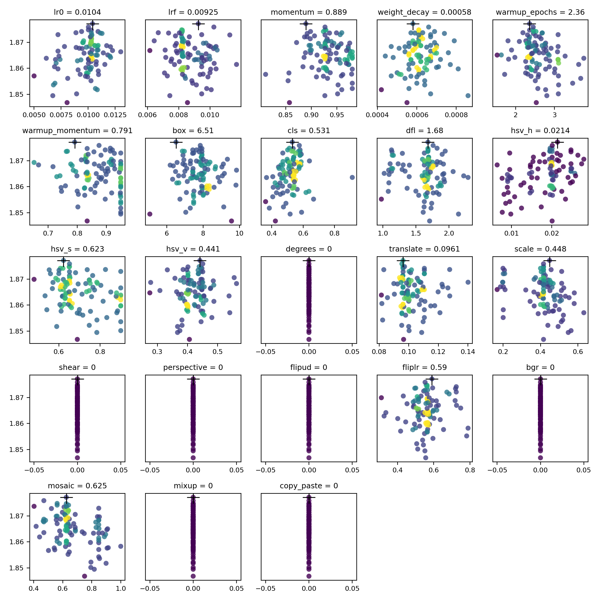

<div align="center">

# [ML] Manga Segment


</div>
<div align="left">

## 📃 | Description

This is a simple project developed in [Python](https://www.python.org), aimed at removing manga backgrounds. I created this because I usually read manga at night.

To use this project in production, you need to install the [Bandwidth Hero](https://bandwidth-hero.com/) browser extension. If you prefer reading manga in a specific reader, I recommend [TachiyomiAZ](https://github.com/jobobby04/TachiyomiSY), which is compatible with [Bandwidth Hero](https://bandwidth-hero.com/).

This project was structured and tested with [U-Net](https://en.wikipedia.org/wiki/U-Net) and [Yolo](https://docs.ultralytics.com)(v8, v11).

| Input | YoloV8n (v0.1) | YoloV8s (v0.2) | YoloV11s (v0.2) |
|--|--|--|--|
|  |  |  |  |

## Diff

| Input | YoloV8n(v0.1) / YoloV8s(v0.2) | Yolov8n(v0.1) / Yolov11s(v0.2) | Yolov8s(v0.2) / Yolov11s(v0.2)
|--|--|--|--|
|  |  |  | 

## Tune
| Model | Tuning Time | Image Size | Epochs/Inter | Iterations | Fitness | Scatter Plots |
|--|--|--|--|--|--|--|
| [YoloV8n](https://github.com/Ashu11-A/Manga-Segment/releases/tag/v0.1) (v0.1) | 45.1h | 1280x1280 | 100 | 100 |  |  |

## Dataset versions

| Property                  | v0.1                        | v0.2                                   |
|---------------------------|-----------------------------|----------------------------------------|
| Images                    | 283                         | ⬆️ 480                                 |
| Train                     | 249                         | ⬆️ 420                                 |
| Valid                     | 22                          | ⬆️ 40                                  |
| Test                      | 12                          | ⬆️ 20                                  |
| Annotations               | 3293                        | ⬆️ 4832                                |
| Annotation comic          | 1258                        | ⬆️ 1938                                |
| Annotation speech-balloon | 2035                        | ⬆️ 2894                                |
| Auto-Orient               | Applied                     | Applied                                |
| Resize                    | Stretch to 963x1400         | ⬜ Fit (white edges) in 963x1400       |
| Auto-Adjust Contrast      | Using Contrast Stretching   | Using Contrast Stretching              |
| Flip                      | Horizontal, Vertical        | Horizontal, Vertical                   |
| Rotation                  | ❌                          | Between -15° and +15°                  |
| Grayscale                 | Applied                     | Applied                                |
| Exposure                  | ❌                          | Between -10% and +10%                  |
| Blur                      | 0.5px                       | ⬆️ 1px                                 |
| Noise                     | 0.5%                        | 0.5%                                   |


## Comparison (Unet vs YoloV8 vs YoloV11)

| Property         | Unet                | YoloV8 (v0.1)            | Yolov8s (v0.2)           | YoloV11 (v0.2)           |
|------------------|---------------------|--------------------------|--------------------------|--------------------------|
| Precision        | 0.7444              | 0.98424                  | 0.96524                  | 0.968                    |
| Recall           | None                | 0.95234                  | 0.97068                  | 0.965                    |
| Val Seg Loss     | None                | 0.7037                   | 0.65568                  | 0.69089                  |
| Val Clas Loss    | 0.23221             | 0.26816                  | 0.31534                  | 0.27078                  |
| Pretrained Model | None                | Yolo Nano                | Yolo Small               | Yolo Small               |
| EarlyStopping    | 26                  | 411                      | 169                      | 251                      |
| Image Set        | 3.882               | 283                      | 480                      | 480                      |
| Image Channels   | 4                   | 3                        | 3                        | 3                        |
| Training Size    | 512x768             | 1280x1280                | 1400x1400                | 1400x1400                |
| Dropout          | 0.2                 | ❌                       | ❌                       | ❌                       |
| Kernel Size      | 3                   | 3                        | 3                        | 3                        |
| Filter           | [32,64,128,256,512] | [64,128,256,512,768]     | [64,128,256,512,768]     | [64,128,256,512,1024]    |
| Artifacts        | high                | low                      | low                      | low                      |

[Details about Yolov8](https://github.com/ultralytics/ultralytics/issues/189)
[Details about Yolov11](https://www.youtube.com/watch?v=L9Va7Y9UT8E)

## 📝 | Cite [This Project](https://universe.roboflow.com/ashu-biqfs/manga-segment)
If you use this dataset in a research paper, please cite it using the following BibTeX:

```
@misc{
  manga-segment_dataset,
  title = { manga-segment Dataset },
  type = { Open Source Dataset },
  author = { Ashu },
  howpublished = { \url{ https://universe.roboflow.com/ashu-biqfs/manga-segment } },
  url = { https://universe.roboflow.com/ashu-biqfs/manga-segment },
  journal = { Roboflow Universe },
  publisher = { Roboflow },
  year = { 2025 },
  month = { jan },
  note = { visited on 2025-01-24 },
}
```

## ⚙️ | Requirements

| Program | Version   |
| ------- | --------  |
| [Python](https://www.python.org)  | [v3.10.12](https://www.python.org/downloads/release/python-31012/) |

## 💹 | [Production](https://github.com/Ashu11-A/Manga-Segment/tree/main/src) (proxy only)

```sh
# Install requirements
cd src
python3.10 -m venv ./python
source python/bin/activate

pip install -r requirements.txt

source python/bin/activate

# Start
python app.py
```

## 🐛 | [Develop](https://github.com/Ashu11-A/Manga-Segment/tree/main/training) (training)

### Install requirements

```sh
# Windows WSL2: https://www.tensorflow.org/install/pip?hl=en#windows-wsl2_1
# Install CUDA: https://developer.nvidia.com/cuda-downloads

sudo apt install nvidia-cuda-toolkit
sudo apt install -y python3.10-venv libjpeg-dev zlib1g-dev
```

### Training

```sh
cd training
python3.10 -m venv ./python
source python/bin/activate

pip install -r requirements.txt
pip install --upgrade pip setuptools wheel
pip install pillow --no-binary :all:

source python/bin/activate
```

Yolo
```sh
# Train normally
python training/start.py --yolo --size 1400

# Look for the best result
python training/start.py --yolo --size 1400 --best

# Train on another model
python training/start.py --yolo --size 1400 --model 10

# Convert model in TensorFlow
python training/start.py --yolo --size 1400 --model 10 --convert # or only --convert without --model for latest model

# Test Model
python training/start.py --yolo --size 1400 --model 10 --test # or only --test without --model for latest model
```

Unet (legacy)
```sh
# Look for the best result
python training/start.py --unet --best

# Run a ready-made script
python training/start.py --unet

# Convert model in TensorFlow
python training/start.py --unet --model 3 --convert
```

##### Saving current Libraries

```sh
pip freeze > requirements.txt 
```

## ⚠️ Error Solutions

#### Error code: ImportError: cannot import name 'shape_poly' from 'jax.experimental.jax2tf'

##### Cause: This error comes from the code itself.

##### Solution:
[https://github.com/google/jax/issues/18978#issuecomment-1866980463](https://github.com/google/jax/issues/18978#issuecomment-1866980463)

```py
# Path: lib/python3.10/site-packages/tensorflowjs/converters/jax_conversion.py

# Remove:
from jax.experimental.jax2tf import shape_poly
PolyShape = shape_poly.PolyShape

# Add:
from jax.experimental.jax2tf import PolyShape
```

#### Error code: Wsl/Service/CreateInstance/MountVhd/HCS/ERROR_FILE_NOT_FOUND

##### Cause: You possibly uninstalled and reinstalled WSL/distribution.

##### Solution:

```sh
# List the distributions installed by running the following in PowerShell.
wsl -l

# Unregister the distribution. Replace "Ubuntu" below with your distribution name found in Step #1:
wsl --unregister Ubuntu-22.04

# Launch the Ubuntu (or other distribution) installed via the Microsoft Store
```

#### Yolo arg --best
##### Error:
```
QObject::moveToThread: Current thread (0x5a75e26f1250) is not the object's thread (0x5a75e21c6fa0).
Cannot move to target thread (0x5a75e26f1250)

qt.qpa.plugin: Could not load the Qt platform plugin "xcb" in "/home/ashu/Documents/GitHub/Manga-Segment/lib/python3.10/site-packages/cv2/qt/plugins" even though it was found.
This application failed to start because no Qt platform plugin could be initialized. Reinstalling the application may fix this problem.

Available platform plugins are: xcb, eglfs, linuxfb, minimal, minimalegl, offscreen, vnc, wayland-egl, wayland, wayland-xcomposite-egl, wayland-xcomposite-glx, webgl.

```

### Solution:
[https://github.com/NVlabs/instant-ngp/discussions/300#discussioncomment-3179213](https://github.com/NVlabs/instant-ngp/discussions/300#discussioncomment-3179213)
```sh
pip uninstall opencv-python
pip install opencv-python-headless
```

## [YoloV8](https://docs.ultralytics.com/models/yolov8):
```
@software{yolov8_ultralytics,
  author = {Glenn Jocher and Ayush Chaurasia and Jing Qiu},
  title = {Ultralytics YOLOv8},
  version = {8.0.0},
  year = {2023},
  url = {https://github.com/ultralytics/ultralytics},
  orcid = {0000-0001-5950-6979, 0000-0002-7603-6750, 0000-0003-3783-7069},
  license = {AGPL-3.0}
}
```

## [YoloV11](https://docs.ultralytics.com/models/yolo11):
```
@software{yolo11_ultralytics,
  author = {Glenn Jocher and Jing Qiu},
  title = {Ultralytics YOLO11},
  version = {11.0.0},
  year = {2024},
  url = {https://github.com/ultralytics/ultralytics},
  orcid = {0000-0001-5950-6979, 0000-0002-7603-6750, 0000-0003-3783-7069},
  license = {AGPL-3.0}
}
```

## [U-Net article](https://arxiv.org/abs/1505.04597):
```
Ronneberger, Olaf, Philipp Fischer, and Thomas Brox.
"U-net: Convolutional networks for biomedical image segmentation."
In International Conference on Medical Image Computing and Computer-Assisted Intervention, pp. 234-241. Springer, Cham, 2015.
```