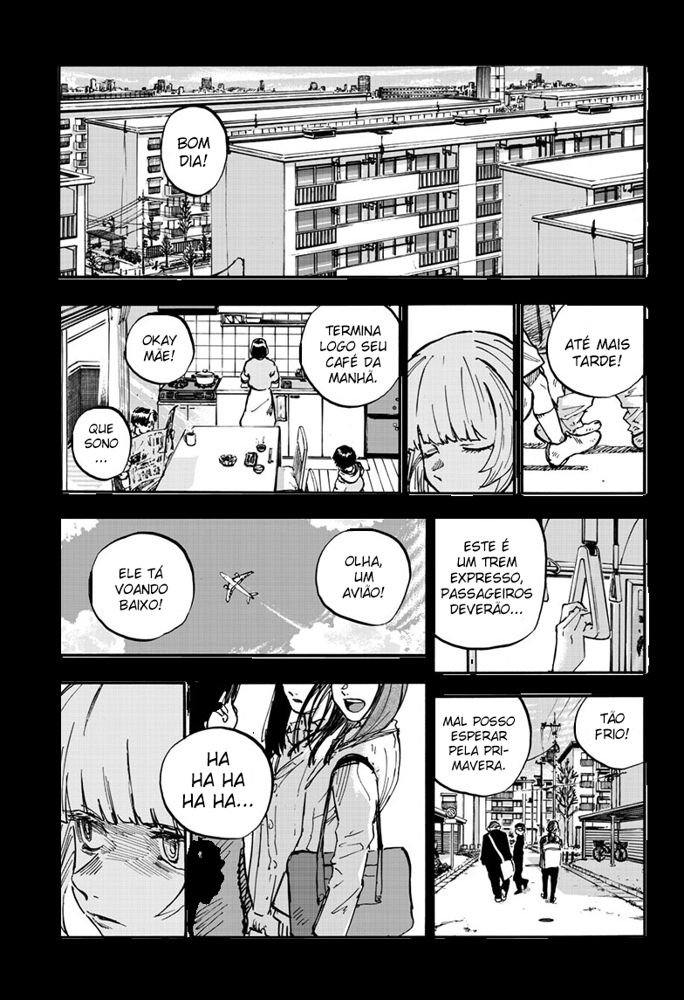

<div align="center">

# [ML] Manga (Dark Mode)


</div>
<div align="left">

## 📃 | Descrição

Este é um projeto simples desenvolvido em [Python](https://www.python.org) (training) e [TypeScript](https://www.typescriptlang.org/) (proxy/tests), baseado no [my-bandwidth-hero](https://github.com/Ashu11-A/my-bandwidth-hero), destinado a remover o fundo de mangás. Eu criei isso porque costumo ler mangás principalmente à noite.

Para utilizar este projeto em produção, é necessário instalar a extensão do navegador [Bandwidth Hero](https://bandwidth-hero.com/). Se você preferir ler mangás em um leitor específico, recomendo o [TachiyomiAZ](https://github.com/jobobby04/TachiyomiSY), que é compatível com o [Bandwidth Hero](https://bandwidth-hero.com/).

Este projeto foi estruturado e testado com [U-Net](https://en.wikipedia.org/wiki/U-Net) e [Yolo](https://docs.ultralytics.com)v8, utilizando [Tensorflow](https://www.tensorflow.org) para produção (Tensorflow é compatével com Javascript).

| Input | [Unet](https://github.com/Ashu11-A/Manga-Convert/releases/tag/v0.2-beta) Output | [YoloV8](https://github.com/Ashu11-A/Manga-Convert/releases/tag/v0.1) Output |
|--|--|--|
|  |  |  |

## Tune
| Model | Time Tuning | Image Size | Epochs/Inter | Iterations | Fitness | Scatter Plots |
|--|--|--|--|--|--|--|
| [YoloV8](https://github.com/Ashu11-A/Manga-Convert/releases/tag/v0.1) | 45.1h | 1280x1280 | 100 | 100 |  |  |

## Comparison ([Unet](https://github.com/Ashu11-A/Manga-Convert/releases/tag/v0.2-beta) vs [YoloV8](https://github.com/Ashu11-A/Manga-Convert/releases/tag/v0.1))

| Property         | Unet                                      | Yolo                                           |
|------------------|-------------------------------------------|------------------------------------------------|
| Val Accuracy     | 0.7444                                    | Precision: 0.96808, Recall: 0.9731             |
| Pretrained Model | false                                     | true                                           |
| EarlyStopping    | 26                                        | 311                                            |
| Image Set        | 3.882                                     | 283                                            |
| Image Channels   | 4                                         | 3                                              |
| Training Size    | 512 x 768                                 | 1280 x 1280                                    |
| Dropout          | 0.2                                       | 0.0                                            |
| Kernel Size      | 3                                         | [3](https://github.com/ultralytics/ultralytics/issues/189) |
| Filter           | [32, 64, 128, 256, 512]                   | [[64, 128, 256, 512, 768]](https://github.com/ultralytics/ultralytics/issues/189) |
| Artifacts        | high                                      | low                                            |

## 📝 | Cite [This Project](https://universe.roboflow.com/ashu-biqfs/manga_convert)
If you use this dataset in a research paper, please cite it using the following BibTeX:

```
@misc{
  manga_convert_dataset,
  title = { Manga_Convert Dataset },
  type = { Open Source Dataset },
  author = { Ashu },
  howpublished = { \url{ https://universe.roboflow.com/ashu-biqfs/manga_convert } },
  url = { https://universe.roboflow.com/ashu-biqfs/manga_convert },
  journal = { Roboflow Universe },
  publisher = { Roboflow },
  year = { 2024 },
  month = { jun },
}
```

## ⚙️ | Requirements

| Program | Vesion   |
| ------- | -------- |
| [Nodejs](https://nodejs.org)  | [v21.7.3](https://nodejs.org/en/blog/release/v21.7.3) |
| [Python](https://www.python.org)  | [v3.10.12](https://www.python.org/downloads/release/python-31012/) |

## 💹 | [Production](https://github.com/Ashu11-A/Manga-Convert/tree/main/src) (only proxy)

```sh
# Install fnm
apt install -y curl unzip

curl -fsSL https://fnm.vercel.app/install | bash
# rode o retorno do fnm, no meu caso:
# export PATH="/home/ashu/.local/share/fnm:$PATH"
eval "$(fnm env --use-on-cd)"
fnm install
fnm use

npm install

# For ARM64
npm rebuild @tensorflow/tfjs-node --build-from-source

# Start
npm run production
```

## 🐛 | [Develop](https://github.com/Ashu11-A/Manga-Convert/tree/main/training) (training)

### Install requirements

```sh
# Windowns WSL2: https://www.tensorflow.org/install/pip?hl=pt-br#windows-wsl2_1
# Install cuda: https://developer.nvidia.com/cuda-downloads

sudo apt install nvidia-cuda-toolkit
sudo apt install -y python3.10-venv libjpeg-dev zlib1g-dev
python3.10 -m venv ./
source bin/activate

pip install -r requirements.txt
pip install --upgrade pip setuptools wheel
pip install pillow --no-binary :all:
```

### Training

```sh
# Active venv
source bin/activate
```

Yolo
```sh
# Train normally
python training/start.py --yolo --size 1280

# Look for the best result.
python training/start.py --yolo --size 1280 --best

# Train on another model
python training/start.py --yolo --size 1280 --model 10

# Convert model in TensorFlow
python training/start.py --yolo --size 1280 --model 10 --convert # or only --convert without --model for latest model

# Test Model
python training/start.py --yolo --model 10 --test # or only --test without --model for latest model
```

Unet
```sh
# Look for the best result.
python training/start.py --unet --best

# Run a ready-made script.
python training/start.py --unet

# Convert model in TensorFlow
python training/start.py --unet --model 3 --convert
```

##### Saving current Libs

```sh
pip freeze > requirements.txt 
```

## ⚠️ Soluções de Erros

#### Error code: ImportError: cannot import name 'shape_poly' from 'jax.experimental.jax2tf'

##### Causa: Esse erro é do próprio código.

##### Solução:
[https://github.com/google/jax/issues/18978#issuecomment-1866980463](https://github.com/google/jax/issues/18978#issuecomment-1866980463)

```py
# Path: lib/python3.10/site-packages/tensorflowjs/converters/jax_conversion.py

# Remove:
from jax.experimental.jax2tf import shape_poly
PolyShape = shape_poly.PolyShape

# Add:
from jax.experimental.jax2tf import PolyShape
```

#### Error code: Wsl/Service/CreateInstance/MountVhd/HCS/ERROR_FILE_NOT_FOUND

##### Causa: Possivelmente você desistalou e reinstalou o wsl/distro.

##### Solução:

```sh
# List the distributions installed, by running following in PowerShell.
wsl -l

# Unregister the distribution. Replace the "Ubuntu" below with your distribution name found in Step #1:
wsl --unregister Ubuntu-22.04

# Launch the Ubuntu (or other distribution) which was installed using Microsoft Store
```

#### Yolo arg --best
##### Error:
```
QObject::moveToThread: Current thread (0x5a75e26f1250) is not the object's thread (0x5a75e21c6fa0).
Cannot move to target thread (0x5a75e26f1250)

qt.qpa.plugin: Could not load the Qt platform plugin "xcb" in "/home/ashu/Documents/GitHub/Manga-Convert/lib/python3.10/site-packages/cv2/qt/plugins" even though it was found.
This application failed to start because no Qt platform plugin could be initialized. Reinstalling the application may fix this problem.

Available platform plugins are: xcb, eglfs, linuxfb, minimal, minimalegl, offscreen, vnc, wayland-egl, wayland, wayland-xcomposite-egl, wayland-xcomposite-glx, webgl.

```

### Sulução:
[https://github.com/NVlabs/instant-ngp/discussions/300#discussioncomment-3179213](https://github.com/NVlabs/instant-ngp/discussions/300#discussioncomment-3179213)
```sh
pip uninstall opencv-python
pip install opencv-python-headless
```

## [YoloV8 article](https://github.com/ultralytics/ultralytics):

```
@software{yolov8_ultralytics,
  author = {Glenn Jocher and Ayush Chaurasia and Jing Qiu},
  title = {Ultralytics YOLOv8},
  version = {8.0.0},
  year = {2023},
  url = {https://github.com/ultralytics/ultralytics},
  orcid = {0000-0001-5950-6979, 0000-0002-7603-6750, 0000-0003-3783-7069},
  license = {AGPL-3.0}
}
```

## [U-Net article](https://arxiv.org/abs/1505.04597):

```
Ronneberger, Olaf, Philipp Fischer, and Thomas Brox.
"U-net: Convolutional networks for biomedical image segmentation."
In International Conference on Medical Image Computing and Computer-Assisted Intervention, pp. 234-241. Springer, Cham, 2015.
```